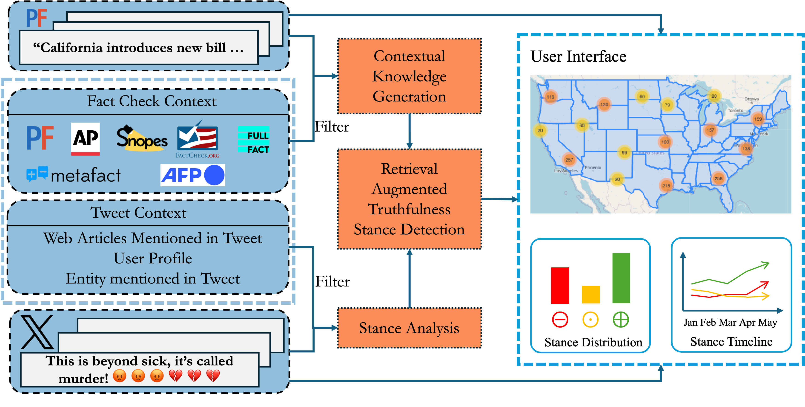

# TrustMap

**TrustMap** is an interactive web application for mapping public stances on the truthfulness of factual claims across U.S. regions, based on social media discourse. It combines retrieval-augmented stance detection with geospatial visualization, enabling users to explore how different areas respond to verified and misinformation-based claims.

**Live Demo**: [trustmap.streamlit.app](https://trustmap.streamlit.app)  
**Video Walkthrough**: [vimeo.com/1070530797](https://vimeo.com/1070530797)


## Installation


1. Install dependencies:
    ```bash
    pip install -r requirements.txt
    ```

2. Start the development server:
    ```bash
    streamlit run streamlit_app.py
    ```

3. Open your browser and navigate to `http://localhost:8501`.

## System Architecture



TrustMap follows a 3-stage pipeline:

1. **Data Ingestion**  
   - Fact-checks sourced from [PolitiFact](https://www.politifact.com/)
   - Tweets collected via X (formerly Twitter) API
   - Geolocation inferred from tweet metadata and user profiles

2. **Truthfulness Stance Detection**  
   - Uses the **RATSD** (Retrieval-Augmented Truthfulness Stance Detection) model
   - Combines context retrieval with LLM-based classification
   - Outputs one of: Positive, Negative, or Neutral/No Stance

3. **Visualization Interface**  
   - Built with [Streamlit](https://streamlit.io/)
   - Interactive U.S. map + dynamic bar and timeline charts


## Key Features

- 🌐 **Geographical Exploration**: Visualize stance distributions at the U.S. state and city level.
- 🔍 **Topic & Claim Filters**: Explore stances by selecting topics or specific factual claims.
- 📊 **Charts & Timelines**: See breakdowns of stance distributions across time and place.
- 🧠 **LLM-Powered Classification**: Uses the RATSD model with fine-tuned large language models and retrieval-augmented generation (RAG).


## License

This project is licensed under the [MIT License](LICENSE).

© 2025 University of Texas at Arlington. All rights reserved. For inquiries, contact us at [idir@uta.edu](mailto:idir@uta.edu).

Visit our lab: [IDIR Lab](https://idir.uta.edu/home/).  
Explore our project: [IDIR Social Sensing](https://idir.uta.edu/home/social_sensing/).